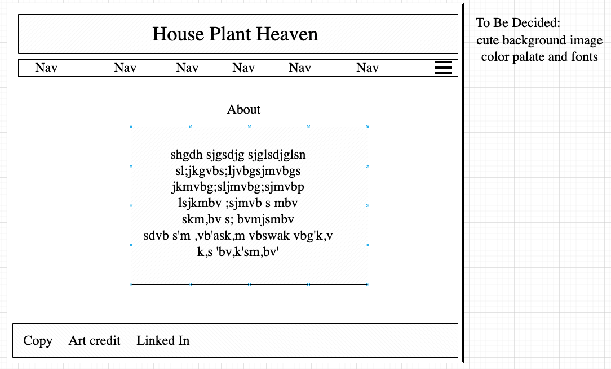
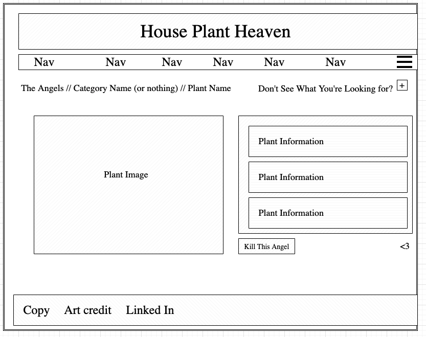
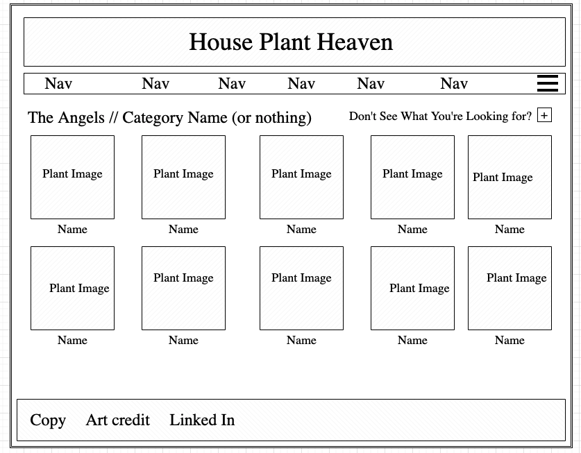

# House Plant Haven

House Plant Heaven is an app where you can find a variety of indoor plants. You can expand your knowledge about different varieties, choose plants based on your specific needs, find distributers, and save your plant crushes to a favorites list. This project was created using react, css, html, javascript, node.js, express, mongoDB, mongoose, heroku, and netlify.

## App Screenshots

## Installation

1. Fork and clone down the repository to your machine.
2. cd into the repo
3. Open in VScode by running code . in your terminal
4. Run npm i or npm install in your terminal
5. Run npm start in your terminal

## User Stories

### MVP

* As a user, I want to be able to navigate to see all the plants in the database, so that I can view all the plant options.
* As a user, I want to be able to view plants by descriptive categories, so that I can narrow my search to types of plants I'm interested in.
* As a user, I want to be able to update a plant in the database, so that I can add that plant to my favorites list for future reference.
* As a user, I want to be able to create a plant for the database, so that I can see a more broad range of plant options to choose from.
* As a user, I want to be able to navigate to individual plants from the database, and view more detailed information about them.
* As a user, I want to be able to delete a plant from the database, so that I can customize my plant search based on preference.
* As a user, I want my web app to use React, so that the site is more streamlined, and doesn't reload with each new navigation.
* As a user, I want my navigation bar to utilize react router, so that the site navigates to each category seamlessly from the home page.

### Stretch Goals

* As a user, I want to be able to be noted in the system as a User, so that my plants and favorites are saved to my login.
* As a user, I want to have restrictions on what plants I can delete or edit, so that the main database stays accurate.
* As a user, I want to be able to use a search bar to find relevant results, so that I don't have to use a nav bar.

### Wire Frames

### Major Hurdles

